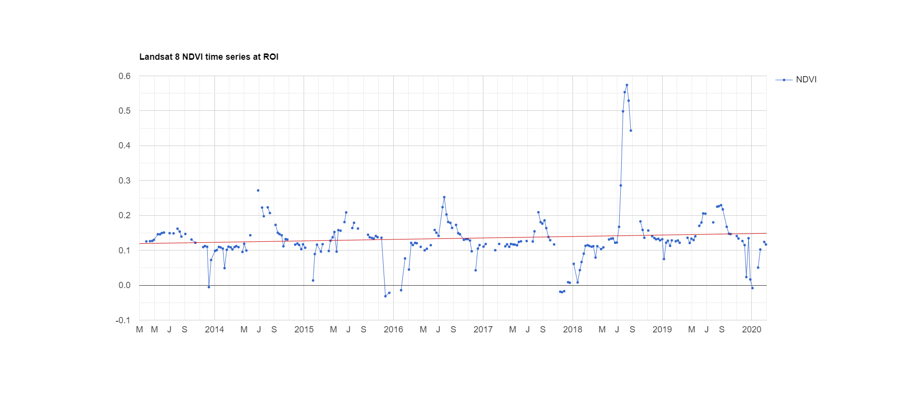

# Earth Engine and Time Series

The primary motivation for doing a time series chart is for the purposes of forecasting and prediction. This is accomplished, in the crudest form, by a linear trend line.

An example of one using the current code in timeSeriesTest.js run through the Earth Engine code editor:

Ideally we will be able to export these graphs not only as image files, but also as .csv files in order to allow further analysis.

Unfortunatly, Google Earth Engines JS libraries do not include ``ui.chart`` calls, and as such we cannot directly use the API to generate .csv files for us. The most immediate work around is to instead filter and extract the data as a JSON, and then translate that data into a .csv format.

# How the data is generated and processed first

We import and process a Landsat image collection to get the NDVI (Normalized Difference Vegetation Index).
Part of the process is to mask out the clouds.
Clouds can give us very inaccurate readings of NDVI because we want to read vegetation, and not clouds. So we mask out clouds, and only take data if we have clear skies.

We later add time and NDVI bands to the image collection in order to let the ``ui.chart`` call access the required properties.

## How NDVI is calculated TL;DR
Plants absorb lots of red light, and reflect lots of near-infrared light. 

So if we take a ratio of:

NDVI = (red light - near-infrared light)/(red light + near-infrared light) 

We can get a fairly accurate measure of vegetation. NDVI is the most commonly used measure for vegetation seen on Earth Engine, and with the abundance of Landsat collections on Earth Engine, we can get a fair number of different readings for this metric.
