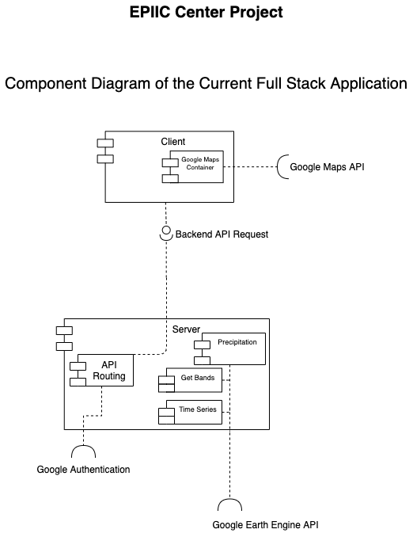
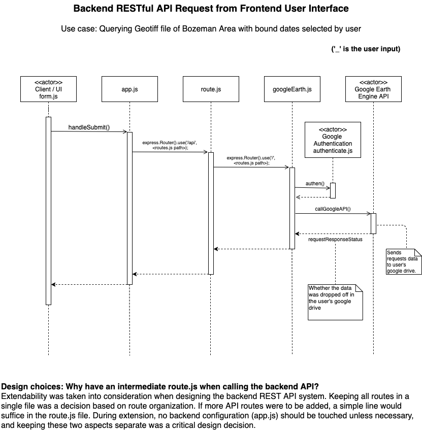

# Developer Documentation

## Project Technologies

We are using React JS as our frontend framework for our website. By using a component based approach to design the web app, it permits us to reuse certain components for multiple pages, and updating a certain component will propagate throughout the system. Also, converting the web app to a mobile platform would be seamless thanks to React Native.\
We are using Node.js for our backend infrastructure and Express as our backend framework. The backend is built to be a REST API so that the frontend and backend is loosely coupled. At the current moment the REST API is available to everyone, meaning that it supports cross-origin requests (CORS).

## Start Contributing

To start contributing to this project, clone [this repository](https://github.com/julianryorex/EPIIC-Project) to a local directory (*You will need Node Package Manager (npm) installed on your local machine*). Since we are using Node, Express, and React, we will have two separate dependency trees; one at the root directory (for the backend) and one in the client directory (frontend). 

To download and stay up-to-date with the various dependencies, install first the backend dependencies.

* navigate to the root directory
* run the following command: `npm install`

Then download the frontend dependencies (*There are more frontend dependecies than backend dependecies*).

* navigate to the client directory
* run the following command: `npm install`

`npm install` will install all dependencies listed inside `package.json` and will create a dependency tree in `package-lock.json`.

Once all dependencies are installed, the web app is ready to run. At the root directory, run `npm run server` to start the backend Node.js server. Then, navigate to the client directory and run `npm start`. 

This will startup the frontend environment and will compile and run all the javascript. This should open up a tab on a browser to showcase the web app. If not, you can go to it by typing [`https://localhost/3000`](https://localhost/3000).

## Layout of the Project

### Frontend

All frontend files are stored at the client directory. Here is a quick visual overview of the frontend structure (some directories/files are ommitted):

```
client
└───public
└───selenium-test
└───src
    └───assets
        └───...
    └───components
        └───chart
            └───chart.js
        └───form
            └───form.js
        └───maps
        └───...
    └───App.js
    └───...
└───.gitignore
└───package.json
└───package-lock.js
└───README.md
docs
...
```

If you have run through the **Start Contributing** step above and installed all dependencies, you should also see a `node_modules` directory (it is a very large directory). This directory is listed in the `.gitignore` file so it will not be part of any commit.

Under exists a `public/` and `src/` directory. Public possesses the `index.html` file (the markdown for the website) and the `src` directory is where all React files lives in. 

The layout of the `src/` directory should not change, unless new directories are put in place. All new components should live in the `components/` folder, with an additional `component` directory and a capitalized `<Component_name>.js` file inside it. All `.css` files related to the `component` file should also live in the directory of the component. Please respect this format for clarity.

### Backend

All backend files are stored at the root directory. Here is a quick visual overview of the backend structure:

```
client
docs
scripts
test
.travis.yml
node_modules
.gitignore
app.js
package.json
package-lock.json
routes
└───authenticate.js
└───getBandData.js
└───getPrecipitation.js
└───routes.js
```

The main backend file is `app.js`; everything will be run through there. For scalability purposes, all routes for api calls are located in `routes`. All HTTP requests are handled in that directory. You can access the main RESTful api page by sending an HTTP GET request to `http://localhost:8080/api`.

### UML Diagrams of Project

Here is a Component Diagram of the current Web Application. One one use case has been implemented and more are in the works.



In order to understand a basic use case, a sequence diagram is attached below. Descriptions of design choices can also be found below.



### Documentation

Many doc files exist for this project. Here is a quick visual overview of each type of doc.

```
docs
└───assets
    └─── ...
└───Earth_Engine
    └─── OAuth2.md
    └───Scripts.md
    └───Time_Series.md
    └───TLDR.md
└───API_Docs.md
└───Product_Specification.md
└───README_dev.md
└───README_user.md
└───test
    └───User_test.md
```

* All **assets** for documentation lives in `/docs/assets` (images, diagrams, .cvs...).
* All **Google Earth Engine** docs lives under `/docs/Eath_Engine`.
    * **OAuth2** summarizes important *Google Authentication APIs*.
    * **Scripts** documents the various backend scripts the system has in place to query the Earth Engine.
    * **Time_Series** mentions the use of time_series data and how to visualize the information on the frontend using charts.
    * **TLDR** quickly summarizes general information about GeoTiff files as well as Google Earth Engine.

* **API_Docs** is the doc file that gets sent to a user whenener they query the base api path: `http://localhost:8080/api`. It acts like a *man* page.
* **Product_Specification** reiterates specific requirements for the EPIIC Center project.
* **README_dev** is this current file. It is a reference for developers that are working on this project or developers that want to contribute.
* **README_user** is a doc for users.

All documentation for this project should reside in the `/docs` directory. **Please add documentation whenever possible!** The more docs the better!

### Bug Tracking

Many bugs reside in our system. To keep track of these bugs and errors, we are using the bug tracking system on GitHub. If a bug appears, do not hesitate to create an issue with a description of the problem.

### Testing

All frontend testing is be located in the client test directory.

```
client
└───selenium-test
```

All backend testing is located in the root test directory, should we use a testing framework (see backend testing for more details).

These should eventually be called automatically by our CI, [Travis CI](https://travis-ci.org/).

#### Frontend Testing

Seleinum was used to test the frontend of the web application. Located in `client/selenium-test`, there exists a file called `quick_test.js`.

This file runs a selenium test that performs many tasks on the homepage of the web application such as filling in the date fields, selecting two markers on the google map, and clicking the submit button.

To run this test, navigate to the selenium-test folder in a terminal window and enter `node quick_test`. The test will then run, and close 10 seconds after the last task.

#### REST API Testing

Because REST API testing is still under research, we decided to use a test scenario - a use case format to record our API testing. This could be automated via bash script, but due to the timeframe of the project this has been done manually and recorded in a [spreadsheet](https://docs.google.com/spreadsheets/d/1sJojYqtSzPRIkcFyqCkycDI9W3SP1zZoOlOb0ePXW3k/edit?usp=sharing).
The speadsheet has the following structure.

Test case ID | Test Senario | Test Steps | Test Data | Expected Results | Actual Results | Pass/Fail
--- | --- | --- | --- | --- | --- | ---
 |  |  |  |  |  |  

Each test case consists of a **Test Case ID** and a **Test Senario**. The Test Senario is a quick overview of what the test *consists* of.

The **Test Steps** will guide the developer in how to achieve this test, along with the necessary **Test Data** (for some GET requests test data is unecessary).

Finally, the developer should mention the **Expected Results** of the tests and record their **Actual Results**, along with whether the test **Passed/Failed**.

Whenever we push out a major release, all of these tests should be run. Automating this heavy lifting job could be a very uselful feature implemented in a future sprint.

### Limitations of the Project

Upon finishing the last sprint for this project, we have discovered numerous limitations that come with the chosen technologies as well as the Google Earth Engine API and Google Maps API.

#### Google Maps API

To retrieve the desired coordinates from the user, we implemented the Google Maps API; the user simply clicks on the map and those locations transcript to coordinates. The user clicks twice on the map so that we can capture the top left corner and the bottom right corner of the RASTER file bounds.

Since our frontend was built using React, we decided to use a 3rd party library which is a wrapper of the Google Maps API using React. This implementation should **not** be done for the final production build as many Maps API features do not work well with this 3rd party library. We recommend using vanilla javascript as all the Maps API Docs are in JS and all features work with vanilla JS.

#### Google Earth Engine API

We are using the Earth Engine API to query our public datasets. One major decision we made was to use a service account instead of a client account. This means that YERC has a single account that queries all requests to the API, given the parameters by the user.

This decision was made as we wanted to keep this application server-side based instead of client-side based. However, we realized during the implementation phase that a lot of Earth Engine functions only function in a client-side based application, meaning that it will not run in the Node.js environment (any function that does not start with `ee.` is client based).
One major function that we planned to use was `Export.toDrive()`.

This is something to think about when developing the production version of EPIIC Center.
